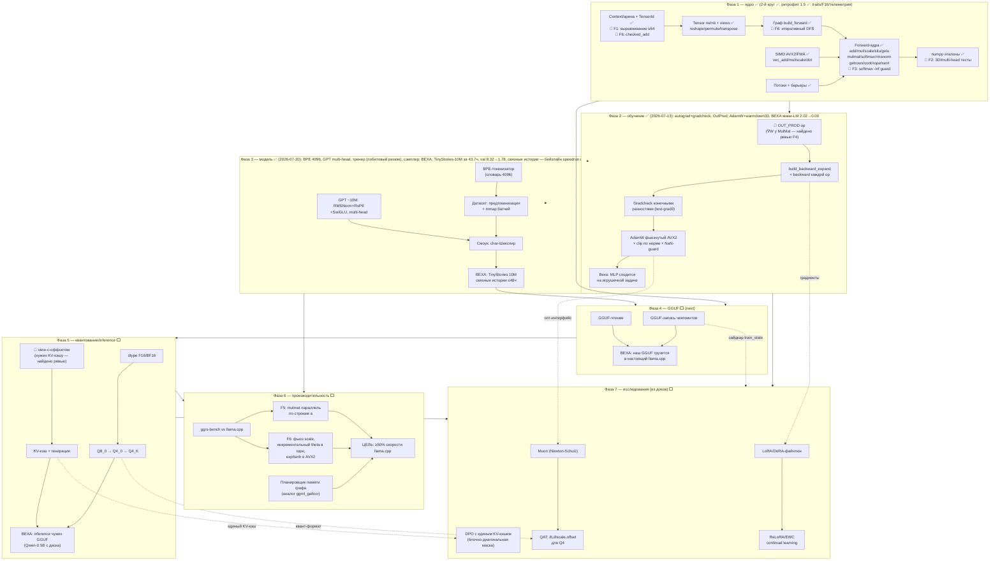

# ggrs — граф проекта: компоненты, зависимости, фазы

Обновлено: 2026-07-20 (Фаза 3 закрыта: ВЕХА TinyStories-10M взята).
Легенда: ✅ готово · 🔄 второй круг · ⬜ впереди · 🔴 обнаруженная скрытая зависимость.

## Стратегическая цель: шум на рынке опенсорса

Три ставки (все зависят от Фаз 2–3 — backward + бейзлайн TinyStories):

| Ставка | Что это | Ниша занята? (по [исследованию](research/2026-07-13-research-base.md)) | Шанс на резонанс |
|--------|---------|--------------|------------------|
| **CPU-спидран** | Лидерборд «TinyStories до val loss X за N минут на ноутбучном CPU», формат modded-nanogpt | **Пуста** — подтверждено поиском; GPU-спидран даёт готовый бэклог трюков | Высокий |
| **Master-weight-free обучение в GGUF-квантах** | ECO-стиль (arXiv 2601.22101: ошибка реквантизации → момент) + наши F4-градиенты scale/offset для block-wise Q4_K, на CPU | Концепция доказана статьёй ECO (01.2026), **реализаций нет**: ни кода, ни block-wise, ни CPU | Средний-высокий: теория валидирована, мы — первый код |
| **Self-evolution демон** | AZR-архитектура (Proposer=Solver + код-верификатор, arXiv 2505.03335) как локальный инструмент | Наука зрелая (GPU, 3B+); инструментом — пуста; на 1–100M эффект никем не доказан | Средний |

Спидран — главная: дешёвый на нашем железе, воспроизводимый, и площадка для скрининга остальных идей. По итогам исследования Muon (вариант Polar Express) повышен до обязательного второго оптимизатора сразу после AdamW-бейзлайна: доказан от 124M (спидран) до 1T (Kimi K2, MuonClip), состоит из одних matmul — идеально для наших AVX2-ядер. Интерфейс оптимизатора Фазы 2 закладывается с крючком error-feedback под ставку №2.

Пятая фаза исследования ([sources-sweep](research/2026-07-13-sources-sweep.md)) добавила якоря:
- **[OpenAI Parameter Golf](https://github.com/openai/parameter-golf)** — официальный бенчмарк (16MB артефакт, FineWeb, лидерборд); их «выигрышные техники» = наш список (Muon WD, Polar Express, Warmdown, Z-Loss). **CPU-форк Parameter Golf — второй формат спидрана** рядом с TinyStories.
- Площадки: NeurIPS 2026 Evaluations&Datasets track (бенчмарк «CPU Training Speedrun» как сабмишн) и Competition track.
- Риски из рецензий: ECO не рецензирован (валидируем сами); Hadamard из QuEST дорог на CPU (альтернатива — FWHT-подходы типа Fast-TurboQuant); GaLore на 1–100M может не давать экономии (ранг близок к полному).
- Кандидаты в бэклог Фазы 7: ZeroQAT (forward-only градиенты — без памяти под активации), квантованный Muon (4-bit GRASP/8-bit), LC-QAT (2 бита на 0.1–10% данных), TinyStories-33M как эталонный бейзлайн с известными гиперпараметрами.

## Критические пути

1. **К первой обученной модели**: арена(F1) → OUT_PROD → backward → gradcheck → AdamW → BPE → TinyStories. Самый длинный и самый ценный путь; всё остальное может ждать.
2. **К совместимости**: GGUF-запись → загрузка в llama.cpp. Не зависит от Фазы 3 по коду, но бессмысленна без обученного чекпоинта.
3. **К inference чужих моделей**: F16 → K-кванты → view-offset → KV-кэш. Самая объёмная фаза по числу форматов.

## Реестр находок ревью (второй круг Фазы 1)

| # | Находка | Тяжесть | Куда |
|---|---------|---------|------|
| F1 | Арена vec\<u8\> — выравнивание f32 не гарантировано (UB) | Серьёзная | 2-й круг Ф1 |
| F2 | 3D mulmat / multi-head rope не тестированы | Серьёзная | 2-й круг Ф1 |
| F3 | SoftMax → NaN на строке из -inf | Средняя | 2-й круг Ф1 |
| F4 | OUT_PROD отсутствовал в плане Фазы 2 | Планирование | план Ф2 |
| F5 | MulMat параллелит по строкам b (T), а не a | Перф | Фаза 6 |
| F6 | Рекурсивный DFS; alloc без checked_add; powf в rope; scale без фьюза; нет view-offset | Мелкие | 2-й круг Ф1 / Ф6 / Ф5 |
