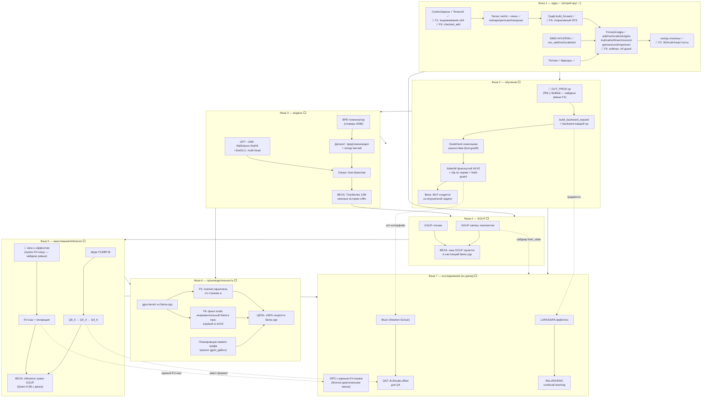

# ggrs — граф проекта: компоненты, зависимости, фазы

Обновлено: 2026-07-12 (после второго круга ревью Фазы 1).
Легенда: ✅ готово · 🔄 второй круг · ⬜ впереди · 🔴 обнаруженная скрытая зависимость.

## Критические пути

1. **К первой обученной модели**: арена(F1) → OUT_PROD → backward → gradcheck → AdamW → BPE → TinyStories. Самый длинный и самый ценный путь; всё остальное может ждать.
2. **К совместимости**: GGUF-запись → загрузка в llama.cpp. Не зависит от Фазы 3 по коду, но бессмысленна без обученного чекпоинта.
3. **К inference чужих моделей**: F16 → K-кванты → view-offset → KV-кэш. Самая объёмная фаза по числу форматов.

## Реестр находок ревью (второй круг Фазы 1)

| # | Находка | Тяжесть | Куда |
|---|---------|---------|------|
| F1 | Арена vec\<u8\> — выравнивание f32 не гарантировано (UB) | Серьёзная | 2-й круг Ф1 |
| F2 | 3D mulmat / multi-head rope не тестированы | Серьёзная | 2-й круг Ф1 |
| F3 | SoftMax → NaN на строке из -inf | Средняя | 2-й круг Ф1 |
| F4 | OUT_PROD отсутствовал в плане Фазы 2 | Планирование | план Ф2 |
| F5 | MulMat параллелит по строкам b (T), а не a | Перф | Фаза 6 |
| F6 | Рекурсивный DFS; alloc без checked_add; powf в rope; scale без фьюза; нет view-offset | Мелкие | 2-й круг Ф1 / Ф6 / Ф5 |
